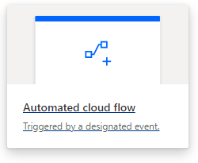
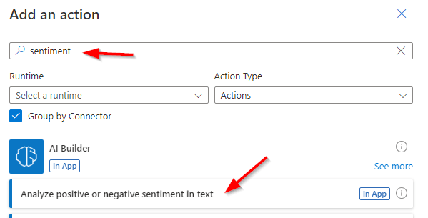
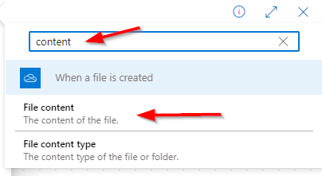
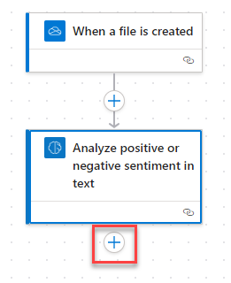
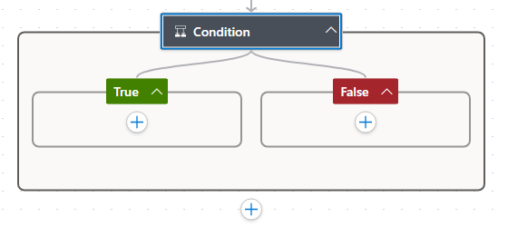
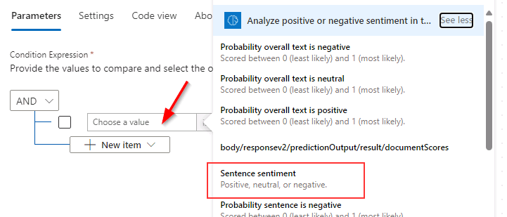
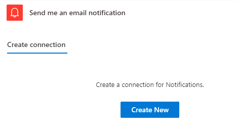
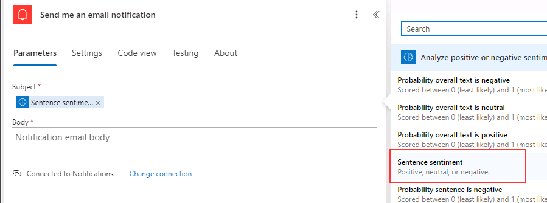
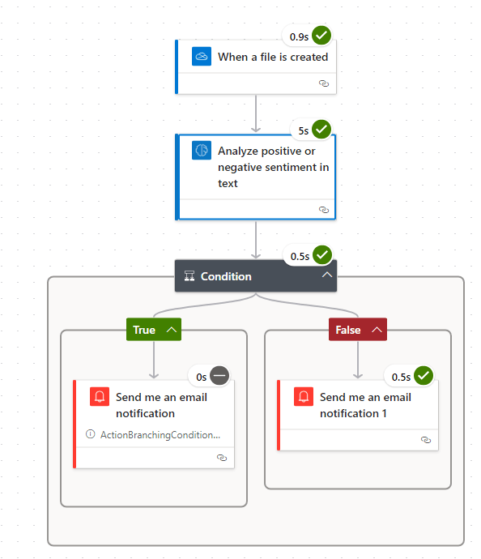

## Exercise 4 - Detect positive, negative, or neutral sentiment

In this exercise rather than use a pre-built model. We will be creating our own model.

- Using the same in-private browser instance, navigate to the [Power Automate site](https://make.powerautomate.com/) if you are not already there. 

- In the top right of the screen, ensure the Environment is set to **Dev One**.

- Choose **Create** from the navigation. 

    
    
- Then choose **Automated cloud flow**

    
    
- In the following prompt select **When a file is created** for the **OneDrive for Business** trigger. Then click **Create**.

    

- Click the **When a file is created** action.

    

- There should be one **Trigger** on the page that needs to be configured.

- Select the **Trigger** and select **Root**
    

    
    
- Next click on the **+** sign and choose **Add an action**

    
    
- In the slideout search for **sentiment** and choose **Analyze positive or negative sentiment in text**. This will add another step to the flow.

    

- The properties side panel will open. In the **Language** section click on the dropdown and choose **English**

    
    
- In the **Text** field we need to pass in the value provided from **OneDrive**. Specifically the content. Click inside the text field and it will be highlighted with a blue bounding box. Then click on the blue lightning bolt.

    
    
- In the popup search for **content** in the text box and then choose **File content**

    
    
- Next click on the **+** sign and choose **Add an action**

    
    
- Search for **condition** and select **Condition** from the options provided

    
    
- The resulting condition

    
    
- Let's set the **Condition** parameters. Click in the **Choose a value** field and you will notice the blue box. Click on the lightning bolt. Then scroll down and select **Overall text sentiment**. In the second text box put in the word **positive**.

    
    
- In the **True** path add another **Action**

    
    
- Search for **notification** and choose **Send me an email notification**

    
    
- You will be prompted to create a new connection. Click **Create New**.

    

- Click in the **Subject** text box and click on the lightning bolt and select **Sentence sentiment**

    

    
- Do exactly the same steps for the **Body** content

- Then repeat the same steps on the **False** path.

- Click on **Save** and wait a few moments until you get a confirmation that the flow has been saved

    
    
- Then click on **Test** and choose the radio button for **Manually** and finally click the **Test** button. Similar to the previous exercise you need to kickoff the test, switch the **OneDrive** and upload one of the sample review files from the downloaded sample data: **AIBuilderLabFiles\Reviews**.

    

    > Note: It may take several minutes for the flow to start after you upload the review to OneDrive. Switch back to the browser tab with your flow to see it start.

- After the flow completes it should resemble the following

    
    
- You can also visit the **Outlook** web client to see the notification and text that was sent.

    

## Summary

In this exercise, you created a flow that leveraged a pre-created AI Builder model to parse and analyze sentiment data out of uploaded review data all without writing any code.