# ChatGPT and Flow

## Exercise 5 - Classify text

- Using the same in-private browser instance, navigate to the [Power Automate site](https://make.powerautomate.com/) if you are not already there. 

- In the top right of the screen, ensure the Environment is set to **Dev One**.


- Choose **+ Create** from the navigation on the left. 

- Next click on the **Automated cloud flow** button.

    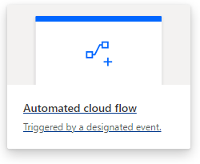
    
- In the following dialog select **When a file is created** for **OneDrive for Business** then click **Create**

    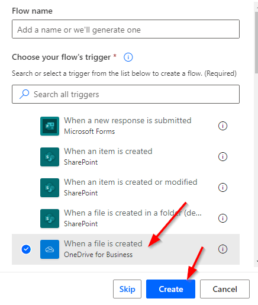


- Click the **When a file is created** action.

    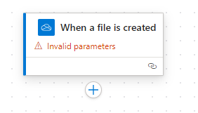

    
- Similar to the previous exercises we need to configure this trigger step. So select the step and choose a folder to use (eg. Root)

    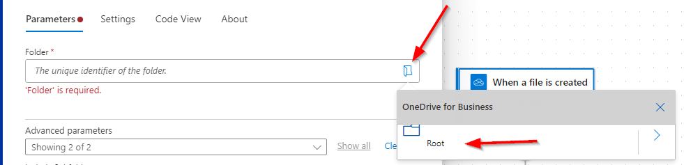
    
- Next click on the plus sign and select **Add an action**

    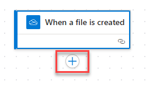
    
- Search for **prompt** and click on the **See more** link under **AI Builder**

    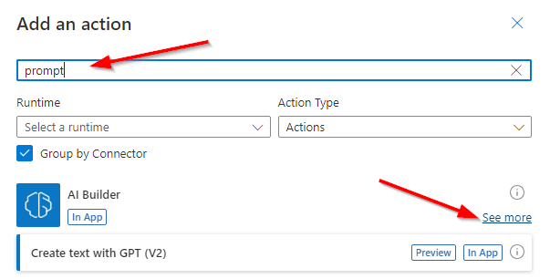

    
- Choose **AI Classify**

    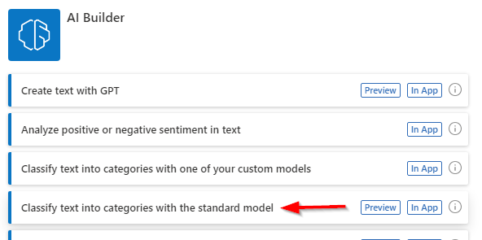
    
- Set the **Input Text** to **File content**

    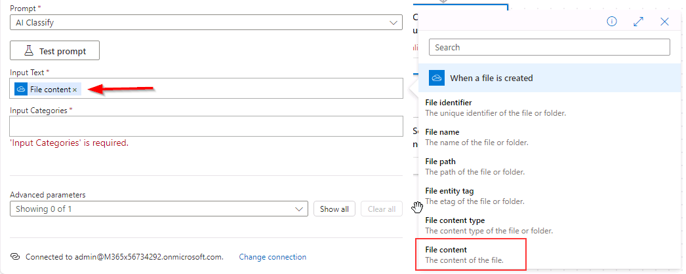
    
- Set the **Input Categories** to the following:

    ```
    positive, negative
    ```
    
- Add another Action 
    
- Search for **notification** and then select **Send me an email notification**

    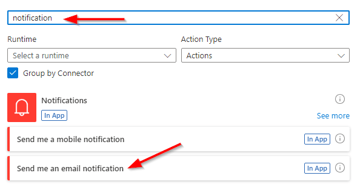

- Click in the **Subject** text box and click on the lightning bolt and set to **Finish reason**

- For **Body** select **Text** from the options

    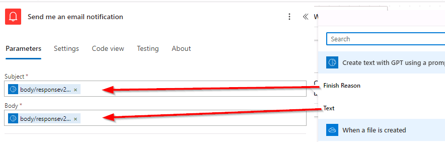
    
- Click on **Save** and wait a few moments until you get a confirmation that the flow has been saved

    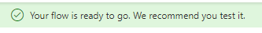
    
- Then click on **Test** and choose the radio button for **Manually** and finally click the **Test** button. Similar to the previous exercise you need to kickoff the test, switch the **OneDrive** and upload one of the files in the **AIBuilderLabFiles\Reviews** folder.

> Note: You will get a notification about adding an Approval process. For this example it is not required but definitely a best practice with any AI generated content.

- Now upload one of the review documents to **OneDrive for Business**

- Review the emails sent in Outlook Web Access to see their classification. 


>**Note**: *Sometimes more than one notification will come across.*


## Summary

In this exercise, you created a flow that leveraged a pre-created AI Builder model to parse and classify sentiment data out of uploaded review data all without writing any code.